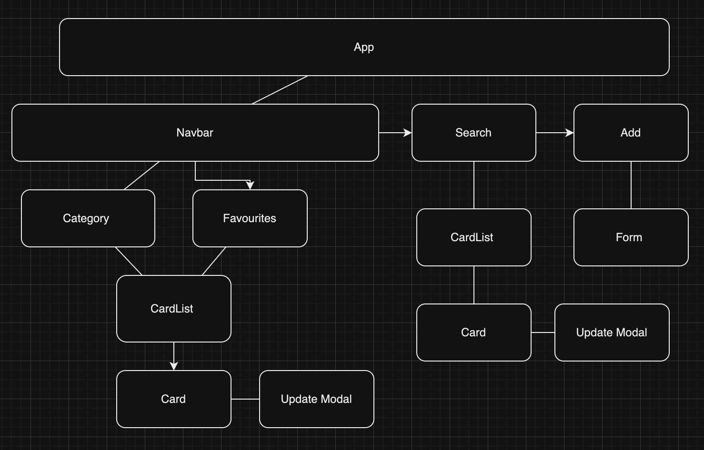

# Full-Stack Online Recipe Book Application

## Description:

After too many food splattered receipe cards, this project aims to develop a full-stack web application for storing, editing, and adding recipes online.

The application will provide a user-friendly interface for managing my recipes. I also want to intergrate a blog/comment section on each page, so that I can leave notes for myself for the future.

## Features:

1. **User Authentication:** For adding, commenting and deleting
2. **Recipe Management:** View, add, edit, and delete recipes.
3. **Comments and Reviews:** Ability to comment on recipes.
4. **Search and Filter:** Search for recipes by name, category
5. **Responsive Design:** The application will be responsive and accessible across different devices and screen sizes.

## Technologies Used:

- **Frontend:** HTML, SCSS, JavaScript, React.js
- **Backend:** Node.js, Java, Springboot

# Update Logs

## Saturday 6th April

Fixed ingredients issue I was encountering with the data not being stored in the database, I changed the data to a string(LONGTEXT) and changed the map function in JS to seperate by commas.

## Saturday 5th April

Had troubles getting the favourite button to work, after spending way too much time going through the code, it was a simple issue of the id not being passed as a prop from the parent container.

## Friday 5th April

Spent some time restyling, thought about adding a shopping list function. I was thinking of having each ingredient have a radio button and when selected, that ingredient is populated into a shopping list. Will most likely need a another database to store these.

Created a HamburgerNav component and will use this to navigate to pages like categories and favourites.

Reconfigured database to have a favourites column and made a love heart icon that can be toggled to filled/unfilled based on if the recipe is a favourite or not. Had issues updating the existing recipes to not have a null value but was able to fix this and get the fetch working again.

## Wednesday 27th March

Was able to identify the issue with the add function, changing the column definition to 'LONGTEXT' however, it looks like I will need to create a relationship for the ingredients if I want to keep them stored as an array.

Added toast notifications, so I could stop checking the console for errors.

Also thinking about adding a boolean field for favourites.

## Tuesday 26th March

Working on the frontend end functionality, having issues with the ingredients and method section working. I was able to make it so that each ingredient is its own `<li>` when seperated by a comma but it seems to max out after too many entries, I think this is the same issue as the method too which is a `String`

Regardless, still happy with the progress I've made.

## Monday 25th March

Started to add styling to recipe cards and think a little more about UX, including adding conditional rendering. Hoping to complete the add page tomorrow and start to build out the data entries a bit more.

## Sunday 24th March

Continued to build basic frontend and made some adjustments to the backend, so that all fields could be updated, as a few weren't working.

## Thursday 21st March

The error was due to serialization, I used 'TRUNCATE' to remove the data from database, so that all new entries had the same some conditions and information.

Finished building the basic backend so that I can fetch, add, update and delete recipes. Added a Model Mapper to make the code more efficient and allowed access to the frontend so no CORS errors would occur.

Started to build frontend using React.JS, will need to read the new docs about the updates with React that just were released.

- Instead of `onsubmit` for any forms I may use there is a new `action` function, including the `useOptimistic` hook for likes/favourites.

- Asset loading to make sure all CSS is loaded prior to render

Draft mapping of app

## Wednesday 20th March

Continued to work on backend. As I was building out the controller and testing in postman my POST and GET requests, I decided to change some of the data types to
`List<String> ` as I think that will better suit my needs moving forward. However, in getting the POST functionality to work, I have broken the GET request functions, so will need to investigate tomorrow.

I started to look at designs I liked, thinking very minimal, as nobody likes to read about the farm that your great uncles wife grew up on when looking at a recipe

or a little more fancy once time permits for me to sketch up some images

## Tuesday 19th March

Continued to work on backend

Thoughts for improvements once MVP completed:

- Having the comments in their own table, so that I can track the date they were created

## Monday 18th March

Scoped projected and started to build backend using Springboot and Java

Database will include the following fields:

- Name
- Image
- Creator
- Category/Tags/Keywords
- Source (url)
- Date Added
- Date Updated
- Ingredients
- Servings
- Method
- Comments
